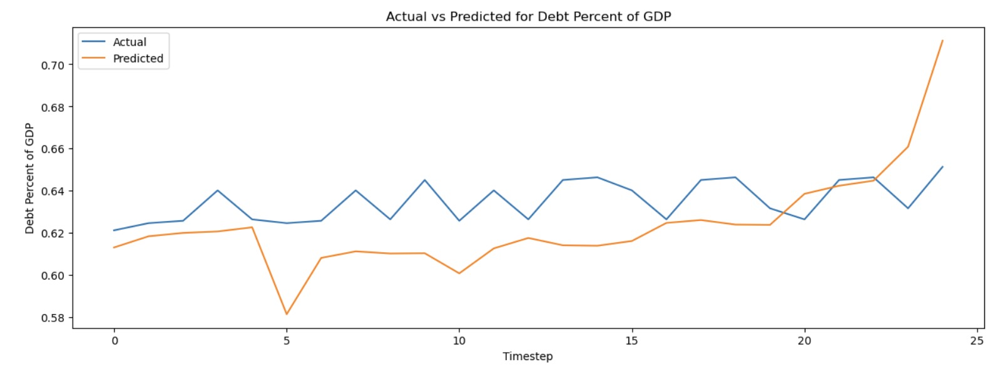
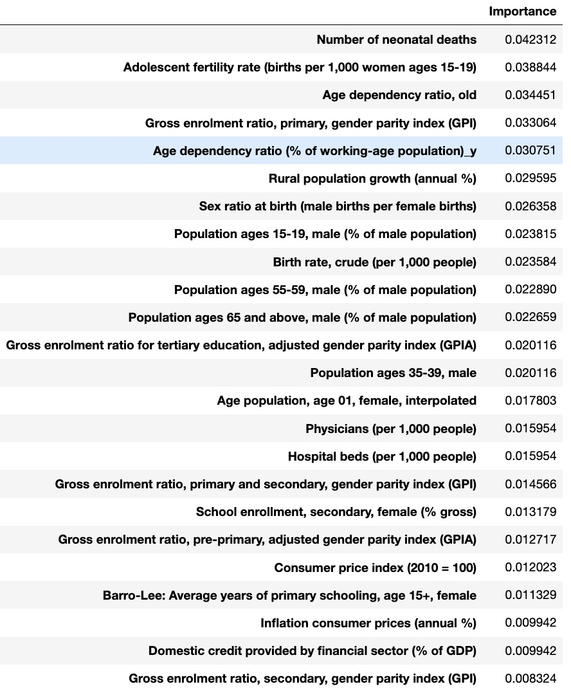
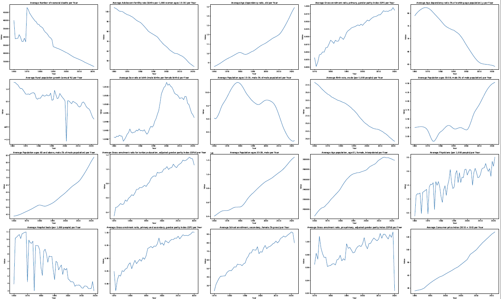
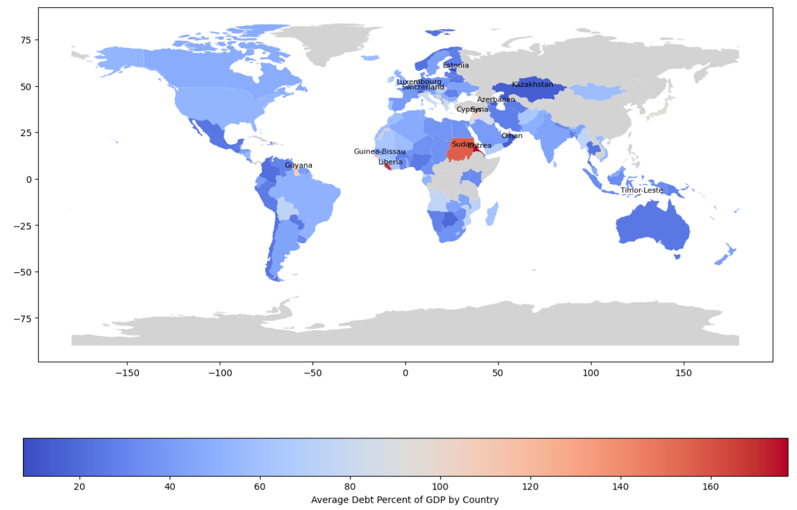

# Global Debt-to-GDP Analysis and Predictive Modeling

## Introduction
This project aims to explore the debt-to-GDP ratio of countries globally through comprehensive data analysis and predictive modeling. The goal is to identify key socio-economic factors that contribute to a country's debt levels, visualize trends, and forecast future debt percentages using machine learning techniques.

Global debt is a critical economic indicator, and understanding its driving factors can help policymakers make informed decisions. This project focuses on:

- Exploratory Data Analysis (EDA) to uncover trends and patterns in the debt-to-GDP ratio.
- Analyzing the importance of various features such as fertility rates, age dependency ratios, and education levels.
- Building and evaluating predictive models for forecasting future debt percentages.

## Project Breakdown

### 1. **Data Preprocessing and Exploratory Data Analysis (EDA)**
The first step in this project involved cleaning and preprocessing the dataset to ensure it was ready for analysis. This included handling missing values, normalizing features, and creating new variables that could add value to the analysis.

During EDA, several key insights were uncovered:
- The average debt-to-GDP ratio varies significantly between countries, with some nations experiencing debt crises while others maintain a relatively low percentage.
- Countries with higher adolescent fertility rates and lower life expectancy tend to have higher debt percentages.
- The age dependency ratio (the proportion of dependents to the working-age population) appears to be a significant indicator of a country's debt level.

#### Visualizations:
- **Global Map of Debt Percent of GDP**: The world map shows the geographic distribution of debt percentages. Countries like Sudan and Eritrea display significantly higher debt levels, indicated in darker red, while others maintain moderate levels.
  
  
  
- **Time Series of Key Features**: The time-series plots below represent trends in various indicators like population growth, sex ratio, fertility rates, and education levels across countries. These metrics were essential to understanding the evolving factors influencing debt levels.

  

### 2. **Feature Importance Analysis**
After performing the EDA, the next step was to determine which features (socio-economic indicators) most significantly affect the debt-to-GDP ratio. This was achieved through feature importance ranking using machine learning algorithms such as Random Forest and XGBoost.

Key findings include:
- The **Number of Neonatal Deaths** was the top feature, indicating a link between healthcare outcomes and national debt.
- **Adolescent Fertility Rate** also stood out as a key factor, suggesting a relationship between population growth dynamics and debt levels.
- Other critical features included **Age Dependency Ratios** (both old and working-age populations) and **Enrollment Ratios** in education.

  

### 3. **Predictive Modeling**
To forecast future debt percentages, various machine learning models were tested, including:
- **Linear Regression**
- **Random Forest**
- **XGBoost**

The models were evaluated using performance metrics such as RMSE (Root Mean Square Error) and MAE (Mean Absolute Error). The XGBoost model showed the best performance, balancing bias and variance effectively.

#### Actual vs Predicted Values:
The line graph below demonstrates the model's performance by comparing actual debt percentages against predicted values over time. While the model follows the general trend, there's room for improvement, especially in predicting spikes and sudden changes in debt levels.

  

### 4. **Key Insights**
- Countries with high dependency ratios (either old or young populations) tend to have higher debt-to-GDP ratios. This is likely due to increased spending on social services like healthcare and education.
- Fertility rates and neonatal deaths, indicative of a country's healthcare system and population growth, are closely tied to debt levels.
- Education enrollment ratios also play a significant role. Countries with higher gross enrollment rates in primary and secondary education tend to have lower debt levels, possibly due to better economic prospects.

### 5. **Challenges and Limitations**
- **Data Availability**: Not all countries had complete data for every feature, which could affect model accuracy. Missing data was either imputed or dropped, but this introduces potential biases.
- **Model Performance**: While the models performed well overall, more complex techniques (e.g., time series modeling or deep learning) might yield better results in predicting sudden spikes in debt.

## Conclusion
This project provides an in-depth analysis of global debt percentages in relation to various socio-economic factors. By leveraging feature importance and predictive modeling, we can better understand which indicators drive debt and forecast future debt levels.

### Future Work
- **Data Enrichment**: Adding more up-to-date or granular data could improve model performance and predictive power.
- **Advanced Modeling**: Exploring time-series forecasting models or deep learning approaches to enhance predictions.

## How to Run This Project

### Prerequisites
Before running the notebooks, ensure you have the following installed:
- Python 3.x
- Jupyter Notebook
- Libraries: `pandas`, `numpy`, `matplotlib`, `seaborn`, `sklearn`, `xgboost`

### Setup Instructions

1. Clone this repository:
    ```bash
    git clone https://github.com/your-repo-name/debt-gdp-analysis.git
    cd debt-gdp-analysis
    ```
2. Install the required Python packages:
    ```bash
    pip install -r requirements.txt
    ```
3. Run the Jupyter Notebooks:
    ```bash
    jupyter notebook
    ```

- **Preprocessing and EDA**: The `Prerpocessing-EDA.ipynb` notebook contains the data cleaning and exploratory analysis.
- **Modeling**: The `Modelling.ipynb` notebook focuses on predictive modeling and evaluating different algorithms.

## Contact
For questions or collaboration opportunities, feel free to reach out to me via [LinkedIn](https://www.linkedin.com/in/jill-karia/) or [GitHub](https://github.com/jillkaria2709).

